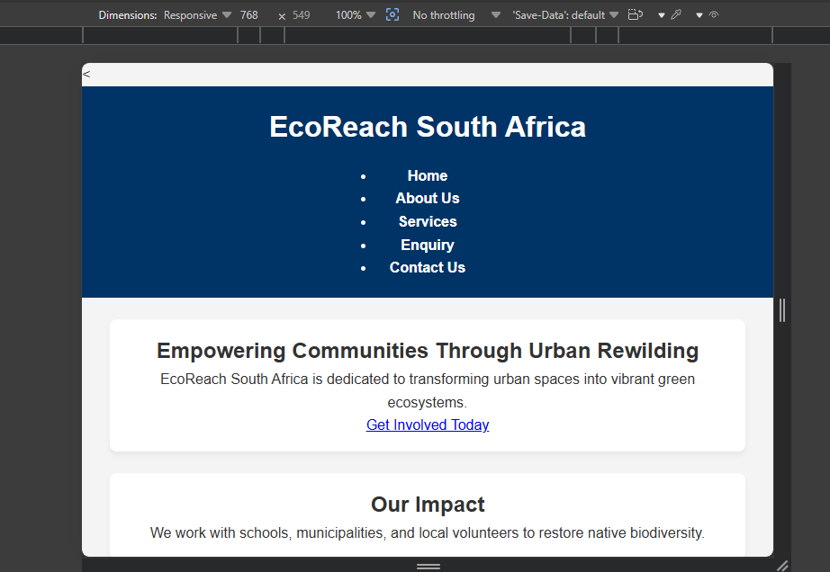

# Web Development Portfolio PoE - EcoReach South Africa

## Organisation Selected
- **Name:** EcoReach South Africa
- **Type:** Non-Profit Organisation (NPO)

## Website Goals & Objectives
- Engage community members through urban rewilding initiatives.
- Provide accessible web portals for volunteer registration, service quotes, and corporate sponsorship enquiries.

## Key Features
- 6 Semantic HTML pages (`index.html`, `about.html`, `services.html`, `gallery.html`, `enquiry.html`, `contact.html`).
- Multi-location operational details for Cape Town and Johannesburg hubs.
- Dynamic interactive features (Lightbox image gallery modal, live search/filtering for services and events).
- Client-side JavaScript form validation with custom error handling.
- Asynchronous form submissions using the JavaScript Fetch API (AJAX).
- Search Engine Optimization (SEO) setup including metadata, XML sitemap (`sitemap.xml`), and crawler directives (`robots.txt`).

## Sitemap
1. Home (`index.html`)
2. About Us (`about.html`)
3. Services (`services.html`)
4. Gallery (`gallery.html`)
5. Enquiry (`enquiry.html`)
6. Contact Us (`contact.html`)

---

## Development Timeline & Milestones
- **Part 1:** Proposal, project setup, semantic HTML architecture, Git tracking.
- **Part 2:** CSS styling, page layouts, responsive design rules, testing evidence.
- **Part 3:** Client-side JavaScript validation, dynamic interactive components, SEO configuration, AJAX form submissions, and live web deployment.

---

## Part 1 Details
- Initialized local workspace with HTML5 elements, multi-page routing, and Git setup.

---

## Part 3 Changelog (Part 2 Feedback Corrections & Part 3 Updates)

### 1. Media Assets & Path Corrections (Part 2 Feedback Fix)
- **Resolved Missing Files**: Verified and included all required gallery image files (`photo1.jpg`, `photo2.jpg`, `photo3.jpg`) within the workspace root folder to fix broken image links upon evaluation.
- **Corrected Responsive `srcset` Resolutions**: Updated gallery image markup to reference distinct lower-resolution image versions (`photo1-600w.jpg`) for the `600w` descriptor and full-resolution images (`photo1.jpg`) for `1200w`, replacing duplicate file path entries.

### 2. Enhanced Responsive Layout Breakpoints (Part 2 Feedback Fix)
- **Small Mobile Breakpoint (`@media (max-width: 480px)`)**: Added explicit layout rules for small mobile displays to optimize font scaling, element padding, and form container sizing.
- **Desktop Grid Breakpoint (`@media (min-width: 1024px)`)**: Implemented explicit 3-column desktop grid layout rules to ensure containers utilize wide displays effectively.

### 3. Documentation & Sitemap Alignment (Part 2 Feedback Fix)
- **Sitemap Expansion**: Updated the README sitemap index to formally include `gallery.html` alongside the core pages.

### 4. Part 3 Feature Additions
- **Interactive Lightbox Modal**: Implemented dynamic JavaScript modal overlay (`script.js`) enabling enlarged image previews upon clicking gallery images.
- **Dynamic Live Search & Filter**: Added live text filtering functionality allowing users to search through service and event cards dynamically on the website.
- **Client-Side Form Validation**: Integrated JavaScript input validation on `contact.html` and `enquiry.html` with real-time error message feedback for phone numbers, email formats, and required fields.
- **AJAX Form Processing**: Configured asynchronous `fetch()` handling for forms with real-time price calculations on `enquiry.html`.
- **SEO Implementation**: Created `robots.txt` and `sitemap.xml` files, added page-specific `<meta name="description">` tags, title elements, and descriptive image `alt` attributes.

---

## Responsive Design Testing Evidence

| Viewport | Dimension | Screenshot Reference |
| :--- | :--- | :--- |
| **Desktop** | 1200px |  |
| **Tablet** | 768px |  |
| **Mobile** | 375px |  |

---

## Deployment & Repository Information
- **GitHub Repository**: https://github.com/sanelisiwedube27-tech/web-dev-part1-2.git
- **Live Deployment Link**: https://sanelisiwedube27-tech.github.io/web-dev-part1-2/

---

## References (IIE Harvard Style)
- EcoReach South Africa, 2026. *Urban Rewilding and Community Conservation Report*. Cape Town: EcoReach Publications.
- MDN Web Docs, 2026. *JavaScript Form Validation and Fetch API*. [online] Available at: <https://developer.mozilla.org> [Accessed 9 October 2026].
- W3C, 2023. *HTML5 Semantic Elements and Accessibility Guidelines*. World Wide Web Consortium. [online] Available at: <https://www.w3.org/TR/html52/> [Accessed 30 July 2026].
- W3Schools, 2026. *CSS Media Queries & JavaScript Manual*. [online] Available at: <https://www.w3schools.com> [Accessed 9 October 2026].